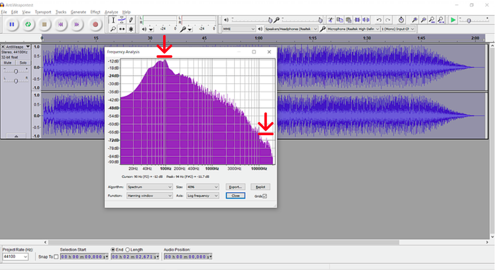
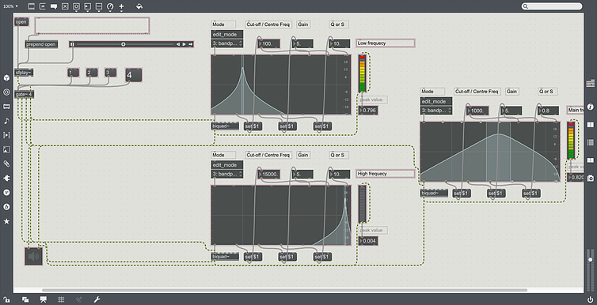

.. figure:: ../_static/index/Cover.jpg
    :align: center

MaxMSP Prototype
================

As being the unique selling point, implementation of music analysis has taken a main role in the game development process. In order to identify and extract useful features, series of segmentation algorithms have been performed onto the music track:

.. note:: Music track for the following prototyping section: `'AntiWeapontest.mp3'`

The most obvious feature to extract from a music track that came up to our mind is its amplitude. The amplitude level signal can be straightforwardly captured. A quick Audacity prototype has been created.

    Frequency Domain Spectrum in Audacity 

It can be easily indicated from the spectrum plotted. From the frequency domain spectrum, typical peak of amplitude which represents the accented drum beat has been detected. The right lower one normally refers to the Cymbal hats lies within high-frequency ranges.

Then a much more precise prototype has been created in MaxMSP:

    MaxMSP Prototype

From the patch, the low-frequency high amplitude and high-frequency features have been separated from the mid-range main melody and utilised for later processing. A demonstration has been shown via this link: https://www.youtube.com/watch?v=jHEnAQop-jE

.. note:: However, Though MaxMSP is a very good music analysis prototyping tool, issues with data transmission using UPD publishers and subscribers have been constantly interrupting the implementation. Therefore, external libraries for real environment implementations have been used which will be shown in next **Implementations** session.