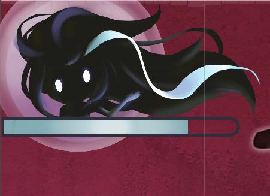

Bubble
~~~~~~

A bubble decoration  in the background visualises the beat detection by expansion and contraction.

.. |bubble_decoration_2| image:: ../_static/graphic_design/background/bubble_decoration_2.jpg
    :align: middle

+------------------------------+------------------------------+
| Bubble Decoration Contracted | Bubble Decoration Expanded   |   
+------------------------------+------------------------------+
| |bubble_decoration_1|        | |bubble_decoration_2|        |
+------------------------------+------------------------------+

This visualisation has been implemented utilising the ``ScaleOnAmplitude`` class:

.. code-block:: C#

    public class ScaleOnAmplitude : MonoBehaviour {
        // ------------------------------------------------------
        // Config Params
        // ------------------------------------------------------

        //
        public float startScale, maxScale;
        //
        public bool useBuffer;

        // ------------------------------------------------------
        // Cached References
        // ------------------------------------------------------

        //private Material material;

        ///////////////
        // Main Loop //
        ///////////////

        void Start() {
            //material = GetComponent<MeshRenderer>().materials[0];
        }

        void Update() {
            if (useBuffer) {
                transform.localScale = new Vector3(
                    (AudioHelper.amplitude * maxScale) + startScale,
                    (AudioHelper.amplitude * maxScale) + startScale,
                    (AudioHelper.amplitude * maxScale) + startScale);
            } else {
                transform.localScale = new Vector3(
                    (AudioHelper.amplitude * maxScale) + startScale,
                    (AudioHelper.amplitude * maxScale) + startScale,
                    (AudioHelper.amplitude * maxScale) + startScale);
            }
        }
    }
