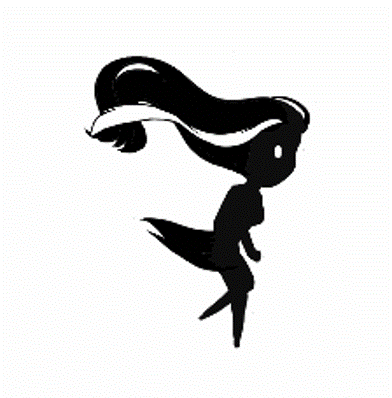

.. figure:: _static/index/Cover.jpg
    :align: center

Graphic Design
==============

The Main Character
------------------

In order to achieve a more natural and fluent effect, the sprites have been traced over the animations done by Richard Williams. The quality of the animation not only afftect asthetic but also player’s experience. if the animation itself wobbles a lot it will influence the way player perceive visual feedback from the character.

.. figure:: _static/graphic_design/running_sprites.png
    :align: center

    Sprites during Running states 

.. figure:: _static/graphic_design/running_sprite_reference.jpg
    :align: center

    Running Sprites Reference

    Running Sprites GIF

Environment
-----------