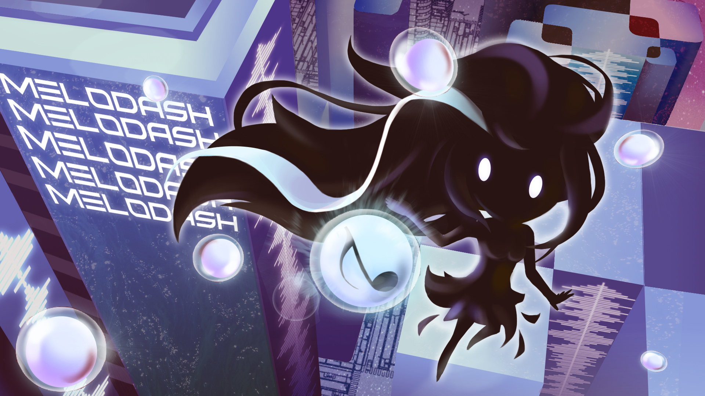
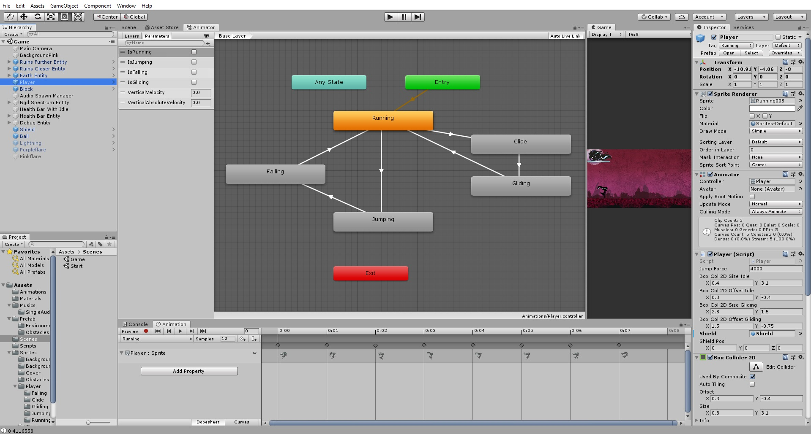
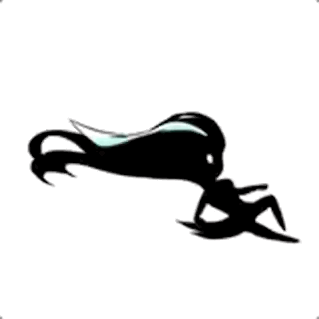

Graphic Design
==============

The Main Character
------------------

The original character concept and **exploded view** has been shown below, all the character postures have been created by manipulating the various parts of the body and limbs.

.. |girl_idol| image:: _static/graphic_design/girl.png
    :align: middle

.. |exploded_view| image:: _static/graphic_design/exploded_view.png
    :align: middle

+-------------+-----------------+
| Girl Idol   | Exploded View   |   
+-------------+-----------------+
| |girl_idol| | |exploded_view| |
+-------------+-----------------+

In order to achieve a more natural and fluent effect, the sprites have been traced over the animations done by Richard Williams. The quality of the animation not only afftect asthetic but also player’s experience. if the animation itself wobbles a lot it will influence the way player perceive visual feedback from the character.

.. figure:: _static/graphic_design/running_sprites.png
    :align: center

    Sprites during Running states 

.. figure:: _static/graphic_design/running_sprite_reference.jpg
    :align: center

    Running Sprites Reference

The animations have been created using Unity Animation tab. All animations are appended to the Player object:

    Unity Animation Tab

The character has 5 basic postures according to different circumstances:

- **Running**: the posture of running on the ground, if the character doesn't perform any other tasks, running will be the default posture.
- **Jump**: where the girl jumps to space, the character may continuously keep jumping in the space.
- **Fall**: the falling posture occurring right after jumping. 
- **Glide**: which is middle transition progress from the previous posture to the keeping gliding gesture.
- **Gliding**: where the girl keeps the continuous gliding gesture.

.. |running| image:: _static/graphic_design/5_postures/running.gif
    :align: middle

.. |jump| image:: _static/graphic_design/5_postures/jump.gif
    :align: middle

.. |fall| image:: _static/graphic_design/5_postures/fall.gif
    :align: middle

.. |gliding| image:: _static/graphic_design/5_postures/gliding.gif
    :align: middle

+-----------+-----------+-----------+-----------+-----------+
| Running   | Jump      | Fall      | Glide     | Gliding   |
+-----------+-----------+-----------+-----------+-----------+
| |Running| | |jump|    | |fall|    | |glide|   | |gliding| |
+-----------+-----------+-----------+-----------+-----------+

.. ---------------------- 

Environment
-----------

